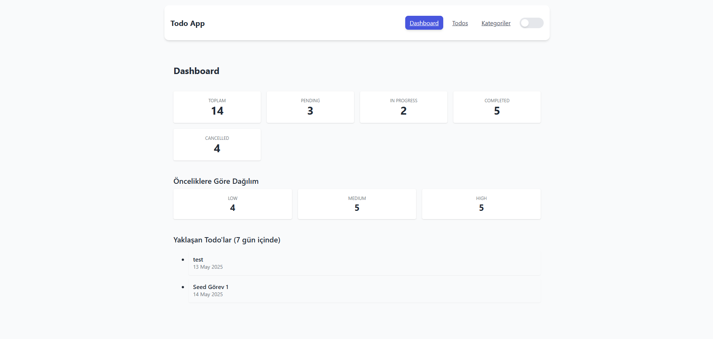

# Todo App

> Laravel API × React UI — built as part of the **PHP + React Todo Case Study** (May 2025)

A fast, keyboard‑friendly task manager with a Kanban board, category tags and tidy API. I wrote it to prove that solid structure, clean code and a bit of Tailwind can go a long way.

---

## ⚡ 30‑Second Tour

| Dark‑mode Kanban          | Classic table view | Category management |
| ------------------------- | ------------------ | ------------------- |
| *(drag, drop, celebrate)* | *(endless scroll)* | *(colour‑coded)*    |

---

## Feature Highlights

* **Drag‑and‑drop Kanban** — updates status instantly with a PATCH request.
* **Search & filters** — text search plus status / priority / category combos.
* **Tags** — every todo can live in multiple colour‑coded categories.
* **Stats endpoint** — totals per status, priority & category for dashboards.
* Friendly dark/light theme switch, toast feedback, and skeleton loaders.

### Bonus Extras

These are beyond the bare‑minimum scope of the case study:

* **Dashboard counters** refresh every 30 s via SWR polling.
* **Category manager** with colour picker and inline validation.

> What’s missing?  Auth, file uploads and offline mode — see the roadmap.

---

## Under the Hood

| Layer | Stack                                         |
| ----- | --------------------------------------------- |
| API   | Laravel 11, PHP 8.3, MySQL 8                  |
| Front | React 18, Vite, Tailwind CSS, React Router v6 |
| Tests | PHPUnit, Cypress, Jest + RTL                  |

---

## Local Setup

### 1. Clone & Boot the API

```bash
cp .env.example .env
composer install
php artisan key:generate
# edit .env with your DB creds
php artisan migrate --seed
php artisan serve      # → http://localhost:8000
```

### 2. Fire up the Frontend

```bash
cd frontend
npm i
npm run dev           
```

The dev server proxies `/api` calls to the Laravel port — no extra config.

---

## Running the App

1. Launch both servers (see **Local Setup**) and open **[http://localhost:5173](http://localhost:5173)**.
2. Click **➕ New Todo** to create your first task.
3. Drag cards between Kanban lanes; the status is PATCH‑ed behind the scenes.
4. Use the **Search** box or **Filters** drawer to find tasks by text, status, priority or tag.
5. Hit the **Categories** tab in the navbar to add, rename, recolour or delete categories — all edits persist instantly.
6. Visit **dashboard** to view the live counters sourced from the `/stats` endpoints.

*(Everything is responsive; it works nicely on mobile.)*

---

## API Cheat Sheet

All routes live under `/api` and reply with a simple envelope:

```json
{ "status": "success", "data": … }
```

### Todos

| Method | Path                 | Purpose                     |
| ------ | -------------------- | --------------------------- |
| GET    | `/todos`             | List (pagination & filters) |
| GET    | `/todos/search`      | Full‑text search            |
| GET    | `/todos/{id}`        | Single todo                 |
| POST   | `/todos`             | Create                      |
| PUT    | `/todos/{id}`        | Update all fields           |
| PATCH  | `/todos/{id}/status` | Just the status             |
| DELETE | `/todos/{id}`        | Soft‑delete                 |

### Categories

| Method | Path                     | Purpose                         |
| ------ | ------------------------ | ------------------------------- |
| GET    | `/categories`            | List categories                 |
| GET    | `/categories/{id}`       | Single category                 |
| POST   | `/categories`            | Create category                 |
| PUT    | `/categories/{id}`       | Update category                 |
| DELETE | `/categories/{id}`       | Delete category                 |
| GET    | `/categories/{id}/todos` | Todos that belong to a category |

### Stats

| Method | Path                | Purpose             |
| ------ | ------------------- | ------------------- |
| GET    | `/stats/todos`      | Totals per status   |
| GET    | `/stats/categories` | Totals per category |
| GET    | `/stats/priorities` | Totals per priority |

#### Example Create Request

```http
POST /api/todos
{
  "title": "Finish README",
  "description": "the human‑sounding one",
  "priority": "high",
  "status": "in_progress",
  "due_date": "2025-05-25",
  "category_ids": [2,3]
}
```

Response → 201 with the full record and its attached categories.

---

## Scripts

```bash
# backend
php artisan test        # PHPUnit unit & API tests

# frontend
npm run test            # Jest + RTL
npm run cypress         # end‑to‑end suite
```

---

## Roadmap

* JWT auth & user accounts
* PWA + offline support
* File attachments (S3)

---

## Screenshots

| Dashboard                                 | Category Management                         |
| ----------------------------------------- | ------------------------------------------- |
|  |  |

| Kanban Board                        | Todo Details                                | Add Todo                                |
| ----------------------------------- | ------------------------------------------- | --------------------------------------- |
|  |  |  |
